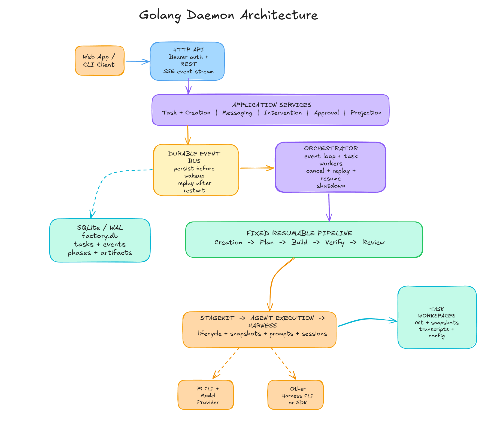

# Software Factory

Software Factory is a self-hosted Next.js application connected to one or more loopback-only Go daemons. The application stores login sessions and daemon registrations in PostgreSQL. Each daemon owns its SQLite state, Task Workspaces, agent sessions, and durable event history.

## Architecture



The daemon persists orchestration commands before waking its background workers, so pending work can resume after restart. Tasks follow a fixed, resumable pipeline:

`Creation -> Plan -> Build -> Verify -> Review`

Planner and Reviewer are read-only. Builder changes the isolated repository, Verifier runs deterministic checks, and the plan requires human approval before building. Task events are exposed through REST and SSE.

See [daemon architecture](daemon/REFACTORING.md) and the [session event contract](docs/SESSION-FORMAT.md) for details.

## Prerequisites

- Node.js 24
- Go
- Git
- Docker with Compose
- [Pi](https://pi.dev) with an authenticated model provider
- GitHub CLI (`gh`) when using GitHub repositories

## Run the application

```bash
cp application/.env.example application/.env.local
```

Set `INITIAL_USER_PASSWORD` in `application/.env.local`, then run:

```bash
POSTGRES_PASSWORD=local-password docker compose up -d
npm ci
npm run application:migrations
npm run application:dev
```

Open `http://localhost:3000`.

For production, run the schema command before `npm run application:build` and `npm run application:start`.

## Run a daemon

```bash
go -C daemon run .
```

The first run creates `~/.software-factory/config.yaml`, prompts, credentials, and local state without replacing existing files. `SOFTWARE_FACTORY_DIR` changes the state directory, `PORT` changes the port, and `PI_PATH` selects the Pi executable.

The daemon listens on `127.0.0.1:8080` by default. Its Swagger UI is at `http://127.0.0.1:8080/docs`. All `/api/v1/*` endpoints except health require the bearer token stored in `~/.software-factory/daemon-token`.

## Connect the daemon

Copy the `connection token` printed at daemon startup, open **Connect daemon** in the application, and paste it. The same token is stored in `~/.software-factory/connection-token`.

For remote access, keep the daemon bound to loopback and use an encrypted tunnel. Add the tunnel's exact origin to `DAEMON_ALLOWED_ORIGINS` in `application/.env.local`.

See [usage](docs/USAGE.md) for the short connection workflow.

## Checks

```bash
go -C daemon test ./...
go -C daemon test -race ./...
npm run typecheck
npm run build
npm run swagger:validate
```
