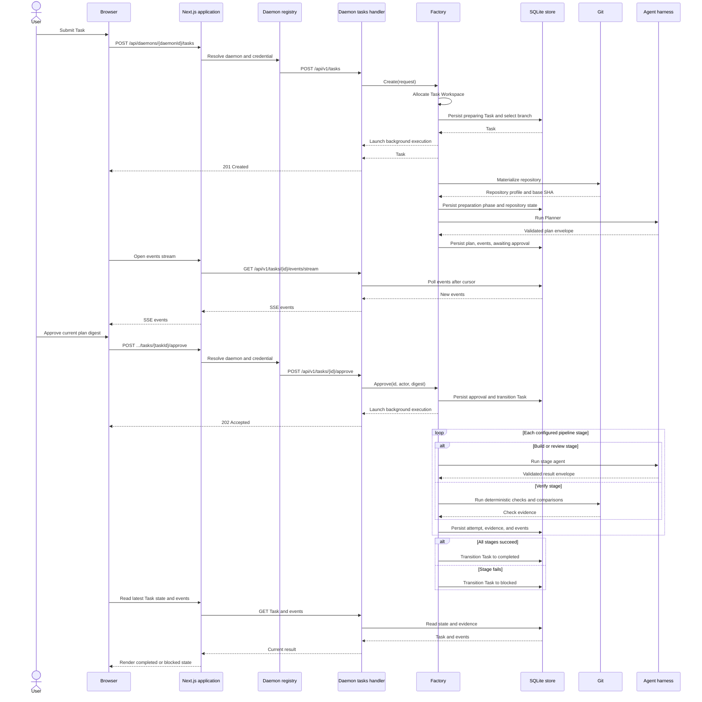

# Boring Software Factory -> bsf

Software Factory consists of a self-hosted Next.js application and independent loopback-only Go daemons. The application owns login and daemon registrations in PostgreSQL. Each daemon coordinates Task Workspaces through Planner, Builder, deterministic checks, and Reviewer using its installed `pi` command.

## Prerequisites

- Go
- Git
- GitHub CLI (`gh`) for GitHub repositories
- Pi with authenticated providers
- Node.js 24 and Docker with Compose for PostgreSQL

## Run the application

PostgreSQL runs in Compose; the application runs via pure npm. Create configuration without committing it:

```bash
cp .env.example .env
cp application/.env.example application/.env.local
```

Replace the placeholders in `application/.env.local`, then start PostgreSQL, apply the application schema, and start the application:

```bash
docker compose up -d
npm ci
npm run application:migrations
npm run application:dev
```

Open `http://localhost:3000`. The PostgreSQL volume persists application login sessions and daemon registrations. Daemon Tasks and logs remain in each daemon's sandbox.

For production use `npm run application:build` then `npm run application:start`. The schema runner is idempotent; back up an existing database, then run `npm run application:migrations` before each application release. For a fresh database, the same command creates all required tables.

## Run a daemon

```bash
go -C daemon run .
```

Interactive Swagger API documentation is available at `http://127.0.0.1:8080/docs`; its OpenAPI document is served at `/swagger.yaml`. The daemon does not serve a frontend. `PORT` changes the port. `SOFTWARE_FACTORY_DIR` changes the default `~/.software-factory` state directory. `PI_PATH` selects Pi. The first run generates `config.yaml` and editable prompts without replacing existing files.

See [`docs/ARCHITECTURE.md`](docs/ARCHITECTURE.md) for how the daemon coordinates the Task repository, agents, checks, events, persistence, recovery, and security. API examples are in [`docs/USAGE.md`](docs/USAGE.md).

The daemon binds only to loopback. Every `/api/*` request except `GET /api/v1/health` requires `Authorization: Bearer <daemon-token>`. The token is generated on first run, persisted at `$SOFTWARE_FACTORY_DIR/daemon-token`, and printed to stdout. To reach the daemon from the application, expose it through an encrypted tunnel whose exact origin is in `DAEMON_ALLOWED_ORIGINS`. Task workspaces, SQLite WAL state, JSONL traces, prompts, and Pi sessions remain under the factory directory until explicit deletion.

## Connecting a daemon to the application

On startup the daemon prints a `connection token` line and writes the same value to `$SOFTWARE_FACTORY_DIR/connection-token`. This token is a self-contained JWT that bundles the daemon endpoint (`http://<bind>:<port>`, derived from the bind address), the daemon identity, the daemon name (the OS hostname), and the bearer credential. In the application UI, open **Connect daemon**, paste the token, optionally override the name (it defaults to the hostname), and submit. The application server verifies the token, checks the endpoint against `DAEMON_ALLOWED_ORIGINS`, confirms the daemon identity, and registers the connection. The credential never leaves the application server.

## API example

`curl` is an API client, not a product CLI.

```bash
TOKEN=$(cat ~/.software-factory/daemon-token)
curl -s -X POST http://127.0.0.1:8080/api/v1/tasks \
  -H "Authorization: Bearer $TOKEN" \
  -H 'Content-Type: application/json' \
  -d '{"request":"Implement feature X","repository":{"type":"local","path":"/absolute/repository"}}'
```

Creating a Task allocates its private workspace, materializes its repository at `workspace/repository`, and starts execution. Agents and checks use that repository as their working directory. Plans contain `questions`; when non-empty, answer them with `POST /api/v1/tasks/{id}/feedback` before approval.

## Task execution sequence



The factory never commits, pushes, merges, deploys, or cleans up automatically.

## Checks

```bash
go -C daemon test ./...
go -C daemon test -race ./...
npm run typecheck
npm run build
npm run swagger:validate
```
