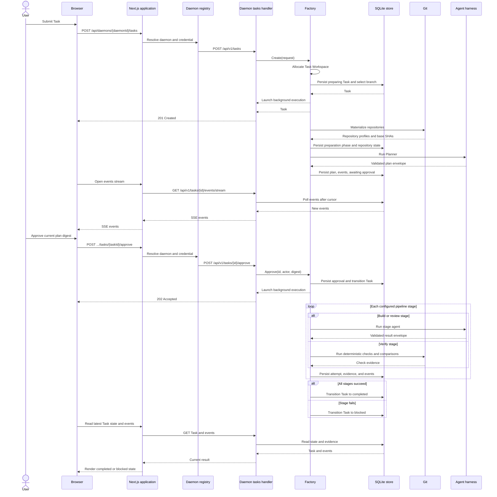

# Refactoring golang code base

## Modules and abstraction
 - Currently factory part contains Allocate Task Workspace
  - This part should be moved into its own module. We should be able to work with Git branches, Git worktrees, Docker containers, and different workspace implementations.

- Factory->>Harness: Run stage agent 
  - This part is also complicated. We can abstract runners and create different runners for each state, such as Planner, Builder, and Reviewer.
  - See how this codebase implemented an executor with its locks and removed lock usage elsewhere: https://github.com/SourceCode/docker/blob/master/daemon/exec/exec.go

- Events currently all the states inserts events directly into db.Events instead we should create EventStore service and factory should send events 
- The entire codebase should be simplified so the factory orchestrates runners for configured Planner, Builder, Reviewer, and other stages.
- After that runners should hand over envelop into next state through the orchestrator. 
- The harness should provide artifacts and results in Markdown so we can store and render them properly in the UI.

## Current Task Execution

