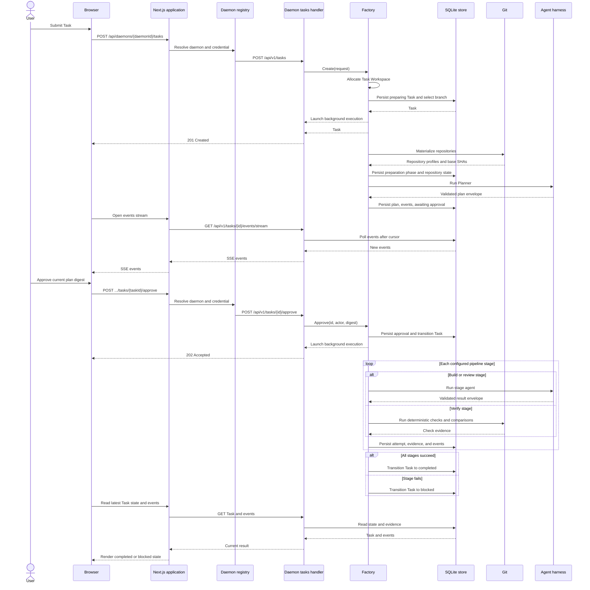

# Refactoring golang code base

## Moduling and abstraction
 - Currently factory part contains Allocate Task Workspace
  - This part should be moved it is own module. And we should be able to work with Git Branches, Git Worktrees, Docker containers and we should be flexibale on working with different workspaces

- Factory->>Harness: Run stage agent 
  - This part also compicated we can abstract Runners and create different runners for each state Like Planner, Builder, Reviewer
  - See this code base how they did executor with it is locks and removed locks usage from everywhere like we do https://github.com/SourceCode/docker/blob/master/daemon/exec/exec.go

- Events currently all the states inserts events directly into db.Events instead we should create EventStore service and factory should send events 
- Entiry code base should be simplified into minimum code and removed most of the part, so factory should do Orchestration through runners, that runs abstracted Planner, Builder, Reviewer and etc based on configs that we provided.
- After that runners should hand over envelop into next state through the orchestrator. 
- And harness should provide artificats/results in MARKDOWN so we should store them and rendere them properly to user in UI.  

## Current Task Execution

