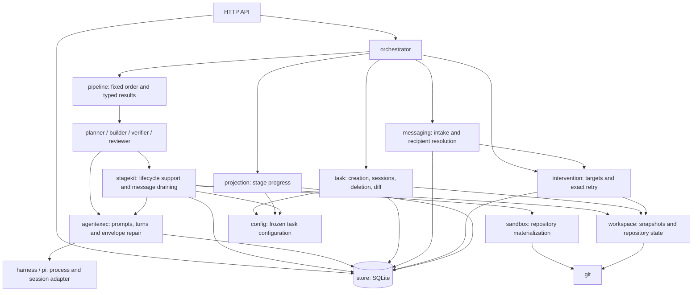

# Daemon architecture

`main.go` composes the pipeline stages and orchestrator. The API delegates task operations to the orchestrator and reads durable resources from the store.

The diagram highlights responsibility boundaries; it is not an exhaustive import graph.

- **orchestrator** owns control intake, approval, task locks, workers, cancellation, and shutdown. It delegates task, message, retry, and projection mechanics to their modules.
- **pipeline** calls Planner, Builder, Verifier, then Reviewer through small interfaces using the value types in `stage`. It returns waiting, blocked, or completed outcomes; it has no persistence or transition logic.
- **stages** own saved-result reuse, attempt lifecycle, validation, evidence, and transitions. Planner prepares the repository and waits for human approval. Builder enforces protected paths. Verifier runs checks and advisory comparisons. Reviewer enforces its verdict. Planner and Reviewer enforce read-only repository access.
- **stagekit** provides shared journal, snapshots, configuration resolution, message draining, locks, and event persistence. Stage locks cover begin and drain/publication boundaries rather than entire agent invocations.
- **agentexec** renders prompts, invokes the harness, validates envelopes, and handles repair turns. **harness/pi** owns Pi process interaction and session event normalization.
- **task**, **messaging**, **intervention**, and **projection** own task allocation/deletion/diffs, durable message intake, retry materialization, and selected-branch stage views respectively.

Approval, resume, messages that require execution, and exact retry return to the same pipeline. Each stage resolves reusable results from durable history. The worker records otherwise unhandled execution failures as blocked and coordinates cancellation for pause, abort, and shutdown.

Task configuration selects stage IDs and agents within the fixed four-stage order. The pipeline does not execute an arbitrary configurable stage list. Deterministic checks run in the verifier, not the Git module.

The Next.js application owns login and daemon registrations in PostgreSQL. Each daemon owns its SQLite state, Task Workspaces, snapshots, reports, events, and Pi sessions. See the [execution sequence](../README.md#task-execution-sequence), [usage](../docs/USAGE.md), and [session event contract](../docs/SESSION-FORMAT.md).
