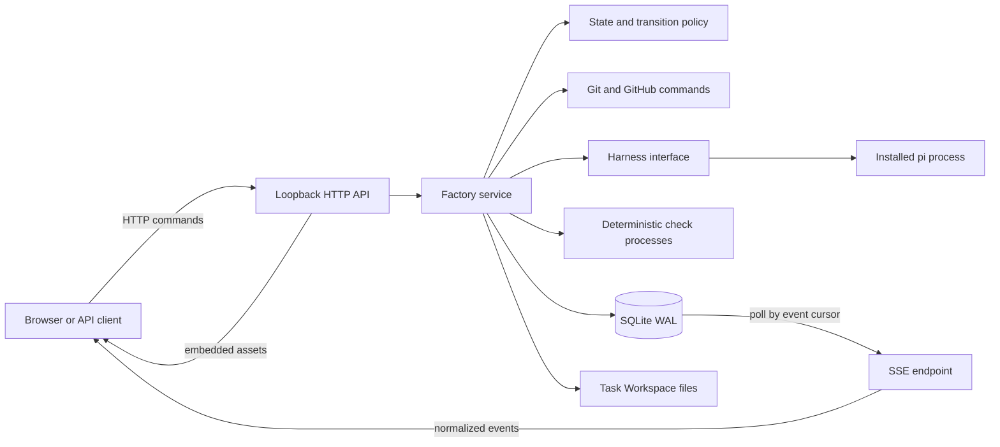
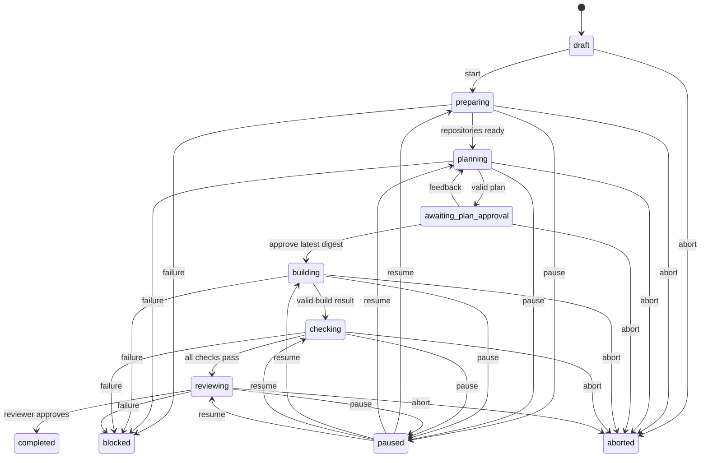
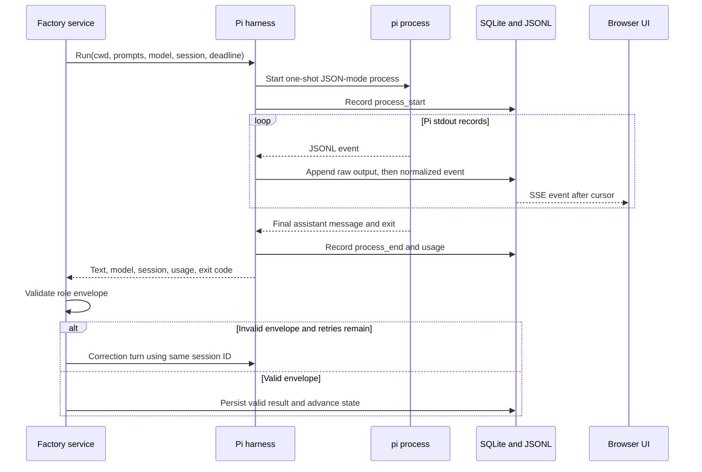

# How the Software Factory daemon works

Software Factory is a long-running, loopback-only Go service that coordinates coding-agent work inside isolated Task Workspaces. The browser UI is the control surface, but the daemon process owns orchestration, repository access, child processes, validation, and durable state.

The service does not daemonize or install a process supervisor. `go run main.go` starts it in the foreground; use an external supervisor if it must survive a terminal or login session.

## System shape

The daemon is deliberately a single-host system: one Go process, one SQLite database, and at most one active Task. There is no remote worker, message broker, or in-memory copy of the durable task model.



The main modules are:

| Module | Responsibility |
| --- | --- |
| `main.go` | Bootstrap, single-server lock, dependency wiring, embedded UI, HTTP listener, and shutdown |
| `internal/api` | REST commands and reads, mutation protection, error mapping, and SSE delivery |
| `internal/factory` | Task lifecycle, phase execution, prompts, envelopes, checks, snapshots, and interventions |
| `internal/store` | SQLite schema, durable state transitions, event cursors, and JSONL trace mirroring |
| `internal/git` | Repository isolation, repository profiles, changed-file detection, and diffs |
| `internal/harness` | Agent-runtime boundary used by orchestration |
| `internal/harness/pi` | Pi command invocation, JSONL consumption, event normalization, usage, and process termination |
| `web` | Vue control surface; it does not own workflow policy |

## Startup and ownership

On startup, the process:

1. Resolves `SOFTWARE_FACTORY_DIR`, defaulting to `~/.software-factory`.
2. Creates private state directories and installs missing default configuration and prompts without replacing edited files.
3. Takes an exclusive lock on `server.lock`, preventing a second daemon from using the same state directory.
4. Opens `factory.db` with WAL, foreign keys, a busy timeout, and `synchronous=NORMAL`.
5. Recovers stale database records from an interrupted prior process and leaves affected work blocked rather than silently resuming it.
6. Loads configuration, registers the Pi harness, and probes the installed Pi model catalog.
7. Starts the API and embedded Vue application on `127.0.0.1:${PORT:-8080}`.

Configuration or Pi validation errors put the server in a degraded state. Read endpoints and the UI remain available, but new Task work is rejected until configuration is valid.

The process handles `SIGINT` and `SIGTERM`. During shutdown it cancels active work, marks active Tasks blocked, shuts down HTTP, closes SQLite, and releases the lock.

## Where work runs

All work runs on the daemon host as the operating-system user that started the daemon:

- Local repositories become detached Git worktrees pinned to the source repository's current `HEAD`.
- GitHub repositories are cloned with the authenticated `gh` command and pinned to the fresh clone's `HEAD`.
- Pi runs in the primary repository materialization.
- Deterministic checks run in the repository to which each check belongs.
- Git, `gh`, Pi, shell checks, and any tools used by Pi inherit the host user's file, credential, and network access.

Creating a draft allocates private Task directories but does not inspect or materialize repositories. Repository access begins only when the Task is started.

## Task lifecycle

The factory, not the agent, controls the workflow state machine.



`Start` atomically claims the single active-Task slot before launching background work. Draft, blocked, paused, completed, and aborted Tasks do not consume that slot. The plan-approval state does consume it so another Task cannot begin while a plan is waiting for a decision.

### 1. Prepare repositories

The daemon materializes every requested repository beneath the Task Workspace. For each repository it records source identity, canonical path, working path, base SHA, checks, generated paths, protected paths, and discovered `AGENTS.md` instructions in an immutable repository profile.

A marked `software-factory` block in `AGENTS.md` is authoritative for checks and path policy. Without one, the daemon detects common Go, Node.js, Python, and Rust checks. The primary repository must have at least one deterministic check.

The daemon also snapshots the resolved configuration for the Task. Later global configuration edits therefore do not change the Task's recorded execution settings.

### 2. Plan

The Planner runs read-only against the primary repository and must return a typed JSON envelope. The daemon validates the envelope and verifies that planning did not change repository files.

The plan includes an explicit `questions` array. A plan with unresolved questions cannot be approved. Feedback is stored with the plan digest and sent through the same stable Planner session to produce a revision. Approval is bound to the exact digest of the latest valid, question-free plan.

### 3. Build

After approval, the Builder receives the request and approved plan. The Builder may edit any Task repository through its available tools, but it cannot decide that the phase succeeded: the daemon validates its result envelope, derives changed files from Git, and rejects changes to protected paths.

The daemon never trusts the Builder's reported `changed_files` as the source of truth. It also never commits, pushes, merges, deploys, or cleans up the repository automatically.

### 4. Check

Checks are ordinary commands from the repository profile. Each command runs through `/bin/sh -c` in its repository, in a separate process group. Full output is written to a private Task log while a bounded tail and exit status are stored in SQLite.

Every required check must pass. An agent cannot waive a failed check, and Reviewer execution does not begin after a check failure.

### 5. Review

The Reviewer receives the original request, approved plan, deterministic check evidence, and Git-derived changed-file list. It must return a consistent typed verdict with requirement-level evidence.

Review is also read-only. The daemon blocks the Task if the Reviewer changes repository files, reports an inconsistent verdict, or rejects the implementation. A Task reaches `completed` only after a valid approval with no blocking or unmet findings.

## Agent process and event flow

Orchestration depends on the small `Harness` interface rather than Pi-specific details. Pi is the only registered runtime today, so another runtime can be added without moving lifecycle policy into the adapter.



Each Task role has a stable session ID and private Pi session directory. Initial turns, Planner feedback, and bounded JSON-correction turns reuse that role session. The Pi adapter:

- invokes an argument vector directly rather than constructing a shell command;
- runs Pi with project approval and without a tool allowlist;
- appends and flushes raw Pi stdout before interpreting each event;
- folds tool start/end records into one bounded normalized `tool_call` event;
- accumulates token usage, context occupancy, and provider cost;
- enforces the configured wall-clock deadline; and
- terminates the complete process group on cancellation.

Raw Pi JSONL is retained for audit. SQLite contains the normalized events used by the API and UI.

## Events and live UI updates

Factory and harness events receive a monotonically increasing SQLite sequence. The SSE endpoint uses that sequence as its event ID.

The SSE connection is a resumable database tail, not a direct in-memory broadcast:

1. The client supplies `Last-Event-ID` or an `after` cursor.
2. The endpoint reads events with a greater sequence from SQLite.
3. It polls for new records every 500 ms and emits a heartbeat every 15 seconds.
4. A reconnect continues after the last observed cursor without intentionally duplicating or skipping records.

This design lets the UI reconnect after a page reload or daemon interruption using durable state instead of depending on an in-process event bus.

## Persistence model

SQLite is the query source for the API. Task files preserve execution inputs and detailed audit material.

```text
~/.software-factory/
|-- config.yaml
|-- factory.db
|-- server.lock
|-- prompts/
`-- tasks/
    `-- <task-id>/
        |-- task.json
        |-- config-snapshot.yaml
        |-- repository-profile.json
        |-- repository-profiles/
        |-- events.jsonl
        |-- prompts/<role>/
        |-- sessions/<role>/
        |   |-- raw-output.jsonl
        |   `-- pi/
        |-- checks/
        |-- artifacts/
        `-- workspace/
            |-- repositories/
            |-- snapshots/<digest>/
            |-- branches/
            `-- attempts/
```

The core durable records are Tasks, repository materializations, phase attempts, events, typed envelopes, checks, child processes, agent sessions, feedback, interventions, branches, artifacts, phase definitions, and workspace snapshots.

Normalized events are inserted into SQLite and mirrored to `events.jsonl`. Exact rendered prompts, raw Pi output, check logs, repository profiles, and content-addressed workspace snapshots stay on disk beneath the Task Workspace. Files and directories are created with owner-only permissions, subject to a stricter host umask.

Task data is retained until explicit deletion. Deleting an inactive Task removes its local worktrees or clone, private files, sessions, snapshots, and cascading database records.

## Pause, failure, and recovery

Active work runs in a background goroutine with a Task-scoped cancellation context. Pause, abort, timeout, and shutdown cancel that context. Pi and check commands run in separate Unix process groups so cancellation can terminate descendants with `SIGTERM` followed by bounded `SIGKILL` fallback.

Failures are pessimistic: a phase starts as `running` and earns `success` only after its operation and validation finish. An unexpected error moves the Task to `blocked` while retaining its workspace and evidence.

The daemon never resumes work automatically after restart. Startup recovery closes stale running process and phase records and leaves affected Tasks blocked for an explicit user decision. Resume re-enters the interrupted section of the linear pipeline and reuses stable role session identity.

The persistence model also supports append-only Interventions, execution branches, phase-definition revisions, and input/output workspace snapshots. These records let the server represent retry, revise, and repair lineage without rewriting historical attempts. The normal automatic scheduler remains the Planner-to-Builder-to-Checks-to-Reviewer pipeline; the transition-policy module determines which intervention actions are valid for a selected attempt or event.

## Security model

The security boundary is the local operating-system user, not a remote multi-user identity system.

- The HTTP server binds only to loopback and does not enable CORS.
- Every mutation requires a random per-process token from the same-origin `/api/v1/control` endpoint.
- Requests with a foreign `Origin` are rejected, and API responses are not cached.
- The state directory, prompts, sessions, raw output, and repository materializations are never exposed through a generic static-file route.
- Embedded UI assets are the only files served outside the API.
- Coding agents and checks have the same host access as the user running the daemon.

The mutation token protects the browser control surface from cross-origin requests; it is not a substitute for host isolation. Run the daemon as a user with only the repositories, credentials, tools, and network access required by its Tasks. Do not expose the loopback service through a public proxy without adding a separate authentication and authorization layer.

## Architectural guarantees

The daemon is designed around these invariants:

- Deterministic Go code owns sequencing, state transitions, checks, and final acceptance; agents only propose and modify work.
- Repository work happens in Task-owned materializations rather than the source checkout.
- Human approval applies to one exact plan digest.
- Required checks and protected paths cannot be waived by an agent response.
- Planner and Reviewer phases are enforced as read-only by comparing Git state.
- Event history, raw runtime output, prompts, sessions, and workspace evidence survive process restarts.
- No operation commits, pushes, merges, deploys, or deletes Task state without an explicit command.

For API commands and examples, see [`USAGE.md`](USAGE.md). For the branch-aware retry and intervention design, see [`retriable-execution.adoc`](retriable-execution.adoc).
